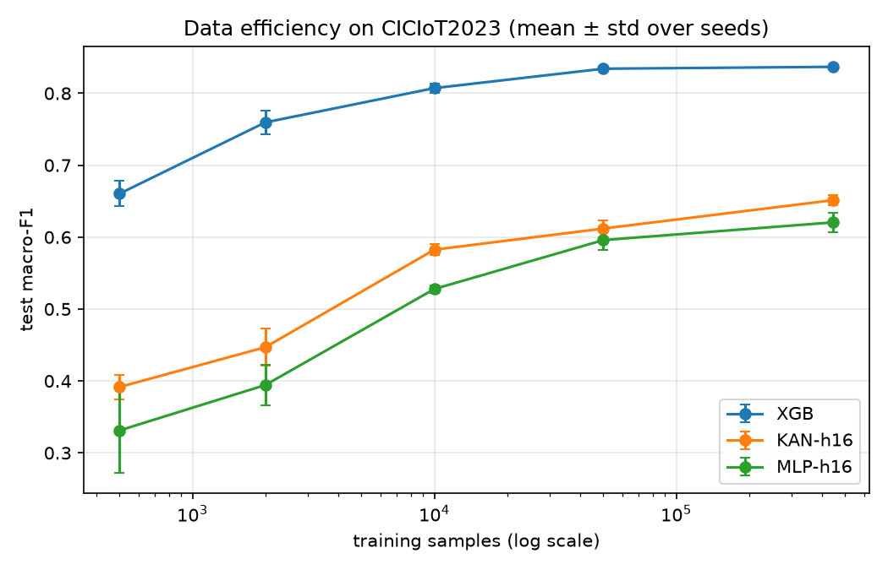

# Detecting Cyberattacks on IoT Devices: KAN vs. MLP vs. XGBoost


## Goal

Investigate whether Kolmogorov-Arnold Networks (KAN) can improve cyberattack detection on IoT devices compared with established machine learning and neural network approaches.

## Research Questions

- **RQ1:** Does KAN perform better than a size-matched MLP?
- **RQ2:** Does KAN have an advantage when trained with fewer samples?
- **RQ3:** How do KAN and MLP compare with XGBoost?
- **RQ4:** Which types of cyberattacks are difficult for the models to detect?

## Approach

- Used the public CICIoT2023 dataset for an 8-class IoT attack detection task.
- Implemented and compared KAN, MLP, and XGBoost models with comparable model sizes.
- Removed duplicate records and kept separate training and test data for evaluation.
- Tested models with 5 random seeds and different training set sizes ranging from 500 to 446K samples.
- Compared macro-F1, per-class F1, and training time across models and training sizes.

## Key Findings

- **RQ1:** KAN achieved a modest +0.03 macro-F1 over the size-matched MLP, but required approximately 3× longer training.
- **RQ2:** KAN performed better than MLP across the tested training sizes, but its advantage did not increase with smaller datasets.
- **RQ3:** XGBoost performed better than both neural network approaches in this setup, achieving 0.837 macro-F1 compared with 0.651 for the best KAN.
- **RQ4:** Rare attack classes, particularly brute-force and web-based attacks, were the most difficult to detect, with F1 ≤ 0.53 across the models.

## Results

Test split, mean ± std over 5 seeds. Macro-F1 over the 8 classes; F1 for the two hardest classes is shown separately.

**Full training data (446,121 samples)**

| Model | Params | Macro-F1 | F1 BruteForce | F1 Web-based | Train time (s) | CPU latency p50 (ms) |
|:--|--:|:--|:--|:--|--:|--:|
| XGBoost | 388,100 (tree nodes) | **0.837 ± 0.001** | 0.527 ± 0.004 | 0.469 ± 0.003 | 12 | 0.34 |
| KAN-h16 | 7,776 | 0.651 ± 0.007 | 0.214 ± 0.032 | 0.196 ± 0.026 | 14 | 0.11 |
| KAN-h8 | 3,888 | 0.639 ± 0.003 | 0.171 ± 0.006 | 0.175 ± 0.011 | 12 | 0.11 |
| MLP-h16 | 7,688 | 0.621 ± 0.014 | 0.182 ± 0.040 | 0.160 ± 0.017 | 4 | 0.01 |
| MLP-h8 | 3,848 | 0.617 ± 0.008 | 0.167 ± 0.022 | 0.155 ± 0.013 | 4 | 0.01 |

XGBoost parameters are total tree nodes and are not comparable to neural network parameters.

**KAN vs. size-matched MLP across training sizes (KAN-h16 − MLP-h16, macro-F1)**

| Training samples | Mean difference | 95% CI | KAN better in |
|--:|--:|:--|:--|
| 500 | +0.060 | [−0.006, +0.127] | 5/5 seeds |
| 2,000 | +0.053 | [+0.033, +0.072] | 5/5 seeds |
| 10,000 | +0.055 | [+0.042, +0.067] | 5/5 seeds |
| 50,000 | +0.016 | [+0.008, +0.024] | 5/5 seeds |
| 446,121 | +0.031 | [+0.014, +0.048] | 5/5 seeds |



## Deployment

- Deployed the trained model as a cloud-based prediction service on Azure Kubernetes Service (AKS).
- Built the deployment using Docker and Terraform and automated testing, security checks, and deployment with GitHub Actions.

## Repository Structure

| Path | Content |
|:--|:--|
| `LLM_Cybersecurity/` | Data preparation, XGBoost baseline, KAN vs. MLP experiments, analysis scripts and result tables |
| `App/` | Flask prediction service, Dockerfile, Kubernetes manifests, Terraform |
| `.github/workflows/` | CI/CD: tests, SAST, dependency audit, image scan, deploy to AKS |

## Reproducing the Experiments

```bash
cd LLM_Cybersecurity/run_kaggle_original
python 01_prepare_data.py          # leakage-controlled train/val/test splits
python 02_baseline_xgboost.py      # XGBoost baseline
python 03_kan_vs_mlp.py            # KAN vs. MLP vs. XGBoost, 5 seeds x 5 training sizes
python 04_analyze_kan_mlp.py       # tables and learning curve
```

## Author

**Thanushree Sridhara**, M.Sc. Computer & Systems Engineering, TU Ilmenau, Germany

[LinkedIn](https://linkedin.com/in/thanushree-sridhara) · [GitHub](https://github.com/Thanushreesridhara)
